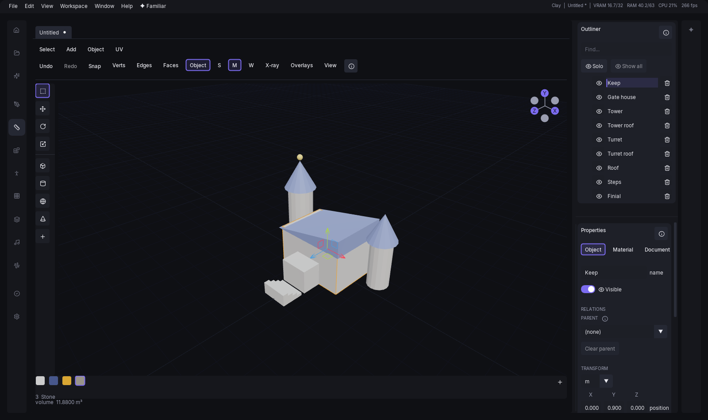
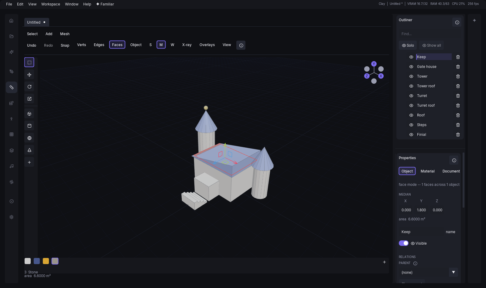
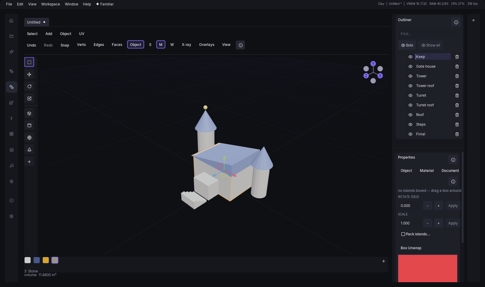
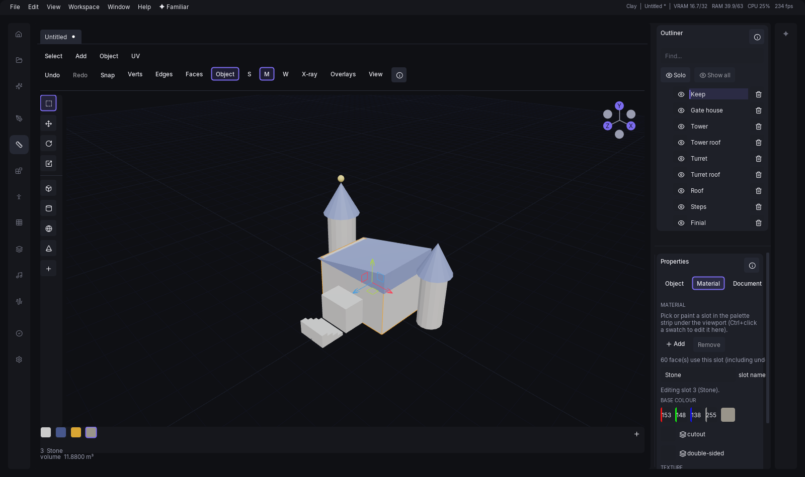

# Clay

Clay is the top-level modelling mode: a small, low-poly modeller with a material palette and
box-projected textures, in the same window as everything else. It exists because the pipeline has one
weak spot that no prompt fixes — if you already know the shape you want, describing it to a diffusion
model and hoping is a poor way to get it. Clay lets you say it directly.

It is deliberately a small tool, in the spirit of picoCAD and Blockbench rather than of Blender: shapes
you place, faces you push and pull, a transform gizmo and a handful of whole-object operations. There
is no modifier stack, no sculpting, no collision-shape editor and no bake — what you see is the mesh,
and the mesh is what leaves. A texture is painted in Inker, which Clay opens for you and takes the
picture back from (see [Texturing](#texturing)), and a game-ready cleanup is the library's.

It is a mode, not a takeover. Switching away leaves every open document exactly where it was. Only
quitting the app can lose unsaved work, and it asks first.

The layout is picoCAD's more than Blender's: almost the whole window is the viewport. Down its left
edge runs a slim **tool rail** — the four transform tools and the shapes — and over it the menu strip and
the header; under it a fixed **palette strip** shows the document's materials. On the right are only
two panes, the outliner and Properties, and Properties' tabs are Object, Material, Document and UV. There
is no left-hand column and no separate file pane. Several documents stay open at once.

## Starting a document

With nothing open, the middle column offers **New model** and **Open a file...**, and lists the
documents you had open recently — clicking one reopens it, and hovering it shows the full path. There
is no separate file pane: every file command is in the **File** menu, which is where Clay's own rows sit among
the ones every mode has — **New**, **Open...**, **Open Recent**, **Save**, **Save As...**, **Export to
library**, **Export GLB...**, **Export OBJ...** and **Save Screenshot...**, with **Undo** and **Redo**
beside them (and as two buttons in the header). `Ctrl+N` and `Ctrl+O` do the same two things from the
keyboard.

Choosing **Clay** from the Home screen opens an empty document for you when there is nothing open
already. When there is, it leaves your documents exactly as they were — the documents *are* the
work, and entering the mode is not a reason to disturb them.

## Adding a primitive

A document with nothing in it says so in the viewport itself — "Add a shape", with "Pick one from
Add" underneath and a button that drops a box at the origin — rather than leaving you to notice an
empty grid and go looking for a shape on your own.

The **tool rail** down the left edge of the viewport has the four transform tools at the top (see
[Transforming](#transforming)) and, under a divider, a few shapes as one-click buttons and a **+**
button. **+** opens a flyout that lists all the shapes **by name**, and the **Add** menu in the menu
strip lists the same ones (see [The menu strip](#the-menu-strip)). **Primitives**: box, plane, grid,
cylinder, cone, UV sphere, icosphere, torus and capsule. **Game**: wedge, ramp, rounded box, stairs,
wall and doorway. That is fifteen, and it is the whole list — Clay no longer builds pyramids, arches,
columns, lathes, sweeps or tubes, because the curve editor that drove the last three went with them;
a column is a cylinder. Clicking one places it at the origin and selects it. Hovering a rail button
names it, and a fresh document does not arrive with a shape already picked.

A shape's own numbers — a cylinder's `radius`, `height` and `segments`, say — are not set before it
is placed: they are edited on the object itself, in Properties, once it exists.

Shapes arrive with their shading already set, by an angle rule: a face is smooth when it meets its
neighbours at a shallow angle all the way round, and flat otherwise. So a sphere, an icosphere, a
capsule and a torus come in smooth, and a box and the flat-panelled game shapes come in flat. A
**cylinder and a cone come in flat too**, and that is the rule working rather than missing them —
every face on the side band meets a flat cap at a right angle, and smoothing the band on its own would
round the cap's rim, which is the edge the cap is there to define. Shade Smooth and Shade Flat
override any of this whenever you want them to.

The game shapes are the pieces a level is blocked out of: each one is a thing you would otherwise
build from three boxes and then have to keep in one piece. A **wedge** is a box with one end cut away
to a sharp edge — a doorstop, a buttress, a roof end. A **ramp** is the same triangular prism lying the
other way, described the way you actually think about a ramp: how `wide` it is, how `long` the run is
and how `high` it climbs. A **rounded box** is a box with its four upright edges rounded off by
`radius`, which is what stops a crate or a kiosk reading as a programmer's placeholder; `segments`
decides how smooth the rounding is, and a radius of zero gives you a plain box back. **Stairs** is a
single flight, built as one continuous surface rather than a pile of blocks: `steps` of them, filling
`total_height` and `total_depth`, with `closed_underside` deciding whether it is a solid mass or an
open flight you can see under. A **wall** is a box named for the job, with `length`, `height` and
`thickness` in the order you would say them. A **doorway** is that wall with a rectangular opening
cut through it, the opening's `width`, `height` and `offset` from centre given directly.

Three of the basic shapes are near-duplicates of others and are worth telling apart. **Grid** is a
plane cut into squares; **plane** is the single quad, which is what a decal or a backdrop wants, and a
grid is what you need the moment you want to bend the sheet, because only interior vertices can move.
**Icosphere** and **UV sphere** are both balls: the icosphere's triangles are all much the same size,
which is what makes it the one to push and pull, and the UV sphere is laid out in latitude and
longitude, which is what makes it the one to wrap an equirectangular texture round. **Capsule**'s
`height` is its cylindrical middle alone, so the whole shape is that plus a radius at each end.

A placed object remembers *how it was made*. Its generator and the parameters it was built with are
kept, so the properties panel offers those parameters — a cylinder's radius, height and segment
count — and changing one rebuilds the mesh. That is a single undo step, so `Ctrl+Z` takes the
object back to the shape it had rather than to some intermediate state.

A rebuild keeps your shading. Change something that leaves the face count alone — a radius, a height
— and whatever shading the object had, hand-picked or automatic, comes through untouched. Change
something that alters the faces themselves, like a segment count, and the shading is worked out
again by the same rule the object arrived with, because they are not the same faces any more.

## The menu strip

The names across the very top of the viewport — **Select**, **Add**, **Object** (or **Mesh** in an
element mode) and **UV** — are where every operation Clay has lives, grouped the way Blender groups
them. They change with the mode: object mode shows Select, Add, Object and UV; vertex, edge and face
mode show Select, Add and Mesh, and the one Mesh menu is the same in all three, drawing only what the
current mode can use. A menu with nothing to offer in the current mode is not drawn, which is why the
element modes have no UV menu. In a narrow window the names fold into a `…` menu with the words back.

**Select** holds select all, none and invert in every mode, and **Select Linked** in the element modes.
**Add** holds the shapes (Primitives and Game) and **Import Mesh...**. **Object** groups what applies
to whole objects into submenus — Transform, Set Origin, Mirror, Parent, Shading and Separate — with
Duplicate, Merge Objects, Recalculate Normals and Delete outside them. **Mesh** is what the element
modes edit with — repeat last, extrude, inset, merge faces, weld, flip, triangulate, subdivide — plus
Set Origin to Selection, and in face mode Shading and Separate Selection. **UV** is the unwrap family:
Box Unwrap and Pack Islands.

A row that cannot run is greyed and hovering it says why; a row with an ellipsis opens a small
dialog of numbers first. The right-click menu in the viewport lists exactly the same operations, in the
same order and with the same groups separated by rules — one table decides both.

That is the whole list. Clay has thirty-eight operations, and every one is a menu row except Frame Selection, which
lives in the header's View popup:

| Menu | Operations |
| --- | --- |
| Select | Select All (`Ctrl+A`), Select None, Invert Selection (`Ctrl+Shift+I`), Select Linked (`L`, element modes) |
| Object | Duplicate (`Ctrl+J`), Merge Objects... (`Ctrl+M`), Recalculate Normals, Delete (`Delete`) |
| Object ▸ Transform | Drop to Ground, Snap to Grid... |
| Object ▸ Set Origin | Origin to Bounds, Origin to Base, Origin to World; Origin to Selection in an element mode |
| Object ▸ Mirror | Mirror X, Mirror Y, Mirror Z, Mirror Copy... |
| Object ▸ Parent | Group Selected, Ungroup, Parent to Last, Clear Parent |
| Object ▸ Shading | Shade Smooth, Shade Flat (also in face mode) |
| Object ▸ Separate | Separate Loose Parts; Separate Selection (`P`, face mode) |
| Mesh | Repeat Last (`Shift+R`), Extrude (`E`); in face mode Inset Faces... (`I`), Merge Faces, Flip Normals, Assign Material..., Subdivide, Triangulate Faces (`T`); in vertex mode Weld... |
| UV | Box Unwrap, Pack Islands... |
| (header) | Frame Selection (`F`) |

Select None has no key of its own: `Esc` steps back through the selection, and `Ctrl+D` deselects.
Everything with a key is also in [Keyboard shortcuts](38-shortcuts.md).

## The viewport header

The row across the top of the viewport is where everything you change *between* clicks lives: which
element mode you are in, which transform tool you are holding, whether snapping is on, and what the
viewport is drawing. All four used to be blocks down a tool panel on the far side of the window from the
model — a reach away from the thing every one of them is about.

**Mode** and **tool** are the two pill groups. The mode pills read **V**, **E**, **F** and **Obj** —
vertex, edge, face and object, in the order of the keys `1`, `2`, `3` and `4`. The tool pills are the
rail's four tools again, so either one lights the same tool. They never fold away, whatever the window
is doing; everything else on the row gives up its label before it gives up its control, and if the
window is narrow enough the rightmost group moves into a `…` menu with the full words back.

**Undo** and **Redo** are two buttons on the header. Each is greyed when there is nothing to take back or
put back, and hovering it says why; they do exactly what `Ctrl+Z` and `Ctrl+Y` do. The history behind
them is one click away in the Document tab (see [The Properties tabs](#the-properties-tabs)).

**Snap** is a button that opens the numbers behind it — a grid size and an angle. The button stays lit
while the setting is on, so a shut popover still says what is armed. It does not grey out while a
document is saving: it touches nothing in the document.

**Solid / Material / Wire** is how the surface itself is drawn. *Material* is the lit render — what
the object will look like. *Solid* is the albedo with no lighting, and it is what you model in: it
shows silhouette and topology without a specular highlight sitting on the vertex you are dragging.
*Wire* replaces the surface with its edges entirely.

**X-ray** (`Alt+Z`) makes the surface see-through, so an element behind it can be picked. It is off by
default because it changes what a click *selects* as well as what is drawn.

**Overlays** is what the viewport draws over the model — the grid, a wireframe over whichever shading
is showing, the statistics line, and the god light. **View** is where the camera looks from and how it
projects; both are described below, under [Axis views](#axis-views) and [Snapping](#snapping).

The **Grid** is a fixed size — 100 m by default, in 1 m cells, with a brighter line every ten of them
— rather than one that follows whatever is on screen, and its own field sits under the Grid row in the
Overlays popover, from 1 to 1000 m. Pressing `F` to frame the selection moves the camera only; it
neither resizes the grid out from under you nor turns the view — you keep looking from the same angle.
The size is remembered across sessions, the way the switch itself already was.

Three marks on the grid say where you are standing in the world: a **red line** along the X axis, a
**blue line** along the Z axis, and a dot at the origin where they cross.

**God light** replaces the ordinary render with a single light straight down from 100 m overhead onto
a flat ground plane under the grid — a deliberately flat, shadowless look for checking silhouette and
proportions rather than the lit render you model under day to day.

### Statistics

The **Statistics** overlay puts one line in the top-left corner: objects, vertices, edges, faces and
triangles, and how many are selected in whichever element mode you are in. It answers "is this mesh
500 triangles or 50,000", which is the question that decides whether a low-poly model is finished.

The edge figure is the count of *distinct* edges, not of face corners: a cube reads 12, not 24.

### The navigation widget

The six balls in the top-right corner of the viewport are the world axes seen from where you are
standing. The lettered ones are the positive ends — X, Y, Z — and their unlettered opposites sit
behind them, which is how the widget tells you which way round you are looking without a label. Click
any ball to look along that axis; it is the same jump `Ctrl+1`, `Ctrl+3` and `Ctrl+7` make, with the
back views one click rather than a chord.

### The hint line

The line under the viewport says what the mouse and the keyboard do *right now*, and it changes with
the mode, the tool and whether a drag is running. It is there because most of the selection verbs are
not buttons: `L` for everything connected, a marquee, `Shift` and `Ctrl` to add and remove. Without
the line the only way to find out what a mode can do is to read this chapter.

## Element modes

Every object starts as one thing you can move about. Press `1`, `2` or `3` and it becomes a mesh you
can take apart: vertices, edges, faces. `4` goes back to object mode. The **Mode** pills in the
viewport header say the same thing, in the same order as the keys — **V**, **E**, **F**, **Obj** — and
highlight whichever mode the document is in.

| Key | Mode | What clicking selects |
| --- | --- | --- |
| `1` | Verts | One vertex |
| `2` | Edges | One edge |
| `3` | Faces | One face |
| `4` | Object | The whole object |

The mode belongs to the *document*, not to the app, so switching tabs does not reinterpret what you
had selected in the other one.

In object mode a selected object is drawn with an **orange outline** along its edges, so you can tell
what a transform or a delete will act on, and the object under the pointer lights up before you click
it. In an element mode the selected elements are highlighted instead.

Going from one element mode to another carries the selection across. Down — faces to edges to
vertices — takes everything the selection touches. Up takes a face only when *every* one of its
edges (or corners) is selected, so two edges of a triangle do not select the triangle.

Clicking replaces the selection, `Shift`+click adds to it and `Ctrl`+click removes from it. Clicking
the object but missing everything on it clears that object; clicking empty space with the **Select**
tool (`Q`) starts a marquee, and a marquee that ends where it started clears everything. A marquee
takes a vertex inside the rectangle, an edge only when *both* ends are inside, and a face only when
*all* its corners are — and it selects through the mesh, back face included, because that is what a
rectangle dragged over a blockout means.

`Alt`+drag always orbits, in every mode. That is the one gesture that is never reinterpreted, since
it is how you look at what you are about to click.

Right-click opens the context menu, listing exactly the operations that apply in the current mode
with the ones that cannot run greyed out. The same table drives the menu strip, so
neither can offer something the other refuses. Operations that take a number — inset, weld, assign
material, merge objects, snap to grid, mirror copy, pack islands — open a small dialog with the fields and an
**Apply** button, and remember what you last used.

`Ctrl+A` selects everything in the current mode's sense of everything, `Ctrl+Shift+I` inverts it, and
`Esc` steps back: first it drops the element selection, then it leaves the element mode, then it
clears the object selection. `Delete` in an element mode deletes *faces*, never the object. In object mode it
removes every selected object as **one** undo step rather than one per object, so a single `Ctrl+Z`
brings the whole selection back. Neither
`Ctrl+A` nor `Ctrl+Shift+I` reaches a **hidden** object, in either sense of everything: hiding
something takes it out of what you are working on, so nothing you select can act on it by accident.
Delete, Duplicate and element drags leave a hidden object alone too, without a message.

**Element selection is transient.** It is not saved with the document, and an undo that changes
geometry drops it — the indices it named describe a mesh that no longer exists. An undo that only
moves or renames something keeps it, because those cannot invalidate it. A properties-panel or agent
edit that rebuilds a shape from its own parameters is different again: if it comes out with the same
faces in the same order (every change to a size, however many are changed at once) the selection, any
per-face paint and the UV layout are carried through unchanged, and so is the shading. Two counts that
trade places for the same face total (a torus's segments and sides, a sphere's segments and rings)
rebuild different faces under the same numbers, so the selection goes and the paint falls back to the
object's own slot. If the face count shrinks the selection is *restricted* to whatever indices still
exist rather than left pointing past the end of a smaller mesh.

### Selecting more than one thing

Clicking picks one element and `Shift`-clicking adds another, and a marquee takes everything inside a
rectangle. `L` selects everything **joined** to what is selected — the way to pick one of two shapes
that were welded into one mesh, and what Separate Selection is about to split off. Clay has no
select-more or select-less, no loop or ring pick and no select-by-similarity: it is a small tool, and
a marquee and `L` between them reach what a low-poly model needs.

### The operations

| Mode | Operation | What it does |
| --- | --- | --- |
| Any | Extrude (`E`) | Pulls the selection off the surface and walls in the gap, then starts dragging what it made — along the face normal in face mode, free in edge and vertex mode. |
| Faces | Inset Faces (`I`) | Shrinks each face in place and rings it with the rim it vacated. The key starts a drag for the thickness. |
| Faces | Subdivide | Splits each face into quads without changing the shape. |
| Faces | Flip Normals | Reverses the winding of the selected faces. |
| Faces | Assign Material... | Paints the selected faces with one palette slot, given by its number along the palette strip, and leaves the object's default slot alone. See [Texturing](#texturing). |
| Faces | Triangulate Faces (`T`) | Replaces each selected face with its own triangles. |
| Faces | Merge Faces | Merges a connected block of selected faces into one n-gon. |
| Verts | Weld | Merges vertices closer together than a distance you give. A vertex joins a group only if it is within that distance of the group's first vertex, so a long run of closely spaced points is not collapsed into one. |

An operation that cannot do what you asked says so in a toast naming the element and what to do
instead, and changes nothing. Those are refusals, not failures: the alternative is geometry that
looks right and is not.

**Merge Faces** is the way to get one face where there were several: a selection that falls into
several disconnected blocks becomes one face *per block*, not one face overall — a face with a hole
in it is not something this editor's meshes can hold, so there would be nothing to make. And a
single face on its own is refused: there is no neighbour to merge it with. Clay has no dissolve or
collapse for vertices and edges.

### Dragging an operation's number

**Inset** (`I`) does not open its dialog from the keyboard. It starts a **drag**: move the pointer and
the result is drawn live, with the operation, the number and its unit beside the cursor (`Inset
thickness 0.050 m`). The distance starts at nothing and grows with how far the pointer has travelled
from where you pressed the key.

Click or `Enter` commits, and it commits **once**: one undo step, the same mesh you would have got from
the dialog at that value, and the adjust card appears afterwards so the number is still in reach.
`Esc` or a right-click cancels, and since nothing is written until the commit the document is exactly as
it was — not even a redraw's worth of change in the history. **Type a number** (`0.1`, then `Enter`) and
the pointer stops mattering: the value is exactly what you typed. A value the operation refuses is
named beside the cursor and the last good picture stays on screen.

A click on the same row in a **menu** still opens the dialog, which is the way to give several numbers at
once or to pick a value you would rather not find with the mouse.

On a very large mesh the preview is redrawn at most about ten times a second once a single redraw
takes more than about 50 ms, so the pointer stays responsive; the commit always runs the real operation
at the pointer's final value.

**Extrude** is one operation in all three modes, because it means the same thing in all three. In
edge mode it grows a quad from each selected *boundary* edge — an edge with a face on each side has
no open side to grow into, and it says so. In vertex mode it extrudes the border edges between the
vertices you selected, which is the only reading available: a mesh here stores faces, not loose
wires, so a vertex on its own has nothing to extrude and says that too.

Pressed as `E`, Extrude also begins a move of what it made — in face mode **locked to the average
face normal**, which is the direction an extrusion goes (`X`, `Y` or `Z` swaps that for a world
axis, and `G`, `R` or `S` switch to a free move, rotation or scale). Click or `Enter` ends it as **one**
undo step; `Esc` or a right-click undoes the extrude as well, so nothing is left behind. The menu's
Extrude does not start a drag. `E` extrudes only in an element mode; in object mode it does nothing.

### Adjusting the last operation, and repeating it

An operation that takes numbers and is run in an element mode — inset, weld, assign material — leaves a
small **adjust card** in the viewport's bottom-left corner; the object-level ones (merge objects, snap
to grid, mirror copy, pack islands) open a dialog but leave no card. It holds the same fields the dialog had,
and changing one re-runs the operation from the state it started in: you see the new thickness on the
mesh, and the whole thing is still **one** undo step, the same mesh you would have got by running the
operation at that value in the first place. If the new value is one the operation refuses, the
previous result stays on screen and the card says why.

The card is there only while the model is exactly as the operation left it. Any later edit, an undo, or
a change to what is selected hides it, because from then on "change the thickness" would no longer mean
"redo that operation".

**Repeat Last** (`Shift`+`R`, and the first row of the **Mesh** menu) runs the last such operation again,
at the same values, on whatever is selected now — inset one face, select another, press it. It remembers
per document, so an agent's own document repeats only what the agent did; with nothing to repeat it says
so.

The first operation that changes an object's topology **freezes** it. A box that has been extruded is
no longer describable as "box, size 1", so the properties panel switches from the generator's
parameters to a vertex and face count.

## Transforming

Rotating and scaling turn about the **median of the selection** — the point the gizmo is drawn at.
With two objects selected the ring is drawn at the median and the document turns about it, rather
than each object spinning about its own origin, and a single object whose origin is not at the centre
of its bounding box orbits the ring you can see.

Four tools, on `Q`, `G`, `R` and `S`, which are also the four buttons at the top of the tool rail:

| Tool | Key | What it does |
| --- | --- | --- |
| Select | `Q` | Click an object in the viewport to select it. With something selected it shows the move gizmo, so a selection can be dragged without switching tool. |
| Move | `G` | Three arrows and three plane handles between them; drag an arrow to slide along that axis, or a plane handle to slide in that plane. |
| Rotate | `R` | Three rings; drag one to turn about that axis. |
| Scale | `S` | Three handles plus a centre handle for uniform scale. |

`G`, `R` and `S` do two things at once: they light the tool, so its gizmo appears, and with something
selected they start a keyboard drag of that kind (see [Moving without a handle](#moving-without-a-handle)).
`E` is not a tool; it is Extrude, and only in an element mode.

A drag is one undo step, recorded when you let go — not one step per frame of the drag, which would
bury everything else in the history.

The gizmos work on elements too. In an element mode they sit at the centre of what is selected
*inside* the objects rather than at the object's own centre, and dragging one moves those vertices.
That is one undo step per drag, and a drag that ends where it started records nothing at
all. **Select** (`Q`) shows the move gizmo for an element selection just as it does for an object, and
the marquee still works: dragging in empty space sweeps a rectangle, dragging the gizmo moves the
selection.

The **Move**, **Rotate** and **Scale** values are also typed directly in the properties panel, which
is the better way to place something exactly. Position and scale boxes are labelled X, Y and Z.
**Rotation is in degrees**, turned X, then Y, then Z -- the same three numbers an agent's
`clay_transform` takes, so what an agent set and what the panel shows are one thing. (The object
itself stores an `XYZW` quaternion, which is what every file this app writes uses.) A rotation can be
written more than one way -- 190° is the same turn as −170° -- so while you are typing, the angles stay
exactly as you typed them; they are read afresh from the object the moment anything else turns it, a
gizmo drag or an undo.

Under the transform is the object's **size**, width, height and depth, and it is editable. It is the
mesh's own extent times the object's scale, so typing a new width sets that axis's scale to match
and nothing else. **lock aspect** carries the other two axes along by the same ratio. An axis the
mesh has no extent on -- the height of a plane -- has nothing to scale from, so the panel says so and
ignores an edit to it. Below that, **world bounds** is the read-only box around the object *after* it
is rotated and placed -- the number a scale of 2 on a generator whose radius is 0.35 does not tell
you, and the same box the camera frames against.

The small combo at the top of the transform picks the **unit** position and size are shown in --
metres, centimetres, millimetres, inches or feet. It changes only what the fields display and
accept; the document, and every file it writes, stays in metres. The import-scale choices in the
Document tab are the same table.

### Moving without a handle

`G` moves the selection, `R` rotates it and `S` scales it, with no handle grabbed: the drag follows the
pointer until you click to commit or press `Esc` to put it back. Every transform in Clay used to go
through grabbing a coloured arrow, which means finding it, which means never moving an object without
first looking at the gizmo rather than at the model.

`G`, `R` and `S` also switch which transform a *running* drag is doing — "move it; no, turn it" is one
gesture rather than a cancel and a restart. The objects go back to where they started first, so a
rotate that follows a half-finished move is measured from the original position and not from wherever
the abandoned move left them.

Each of the three is also its tool's letter, so the key and the tool never disagree: after pressing
`R` to turn something, the Rotate tool is the one lit, and its rings are what you grab next. With
nothing selected the key only chooses the tool. `Shift`+`R` is not a tool; it is Repeat Last.

A keyboard drag holds no mouse button, so a **press** is how it ends: left commits, right cancels.
Everything else behaves exactly as it does under a handle drag — the axis lock, the typed value and
`Esc` are the same code and are described next.

### Locking an axis, and typing a number

The keyboard joins a drag already under way. While a gizmo is held:

| Key | What it does |
| --- | --- |
| `X` / `Y` / `Z` | Lock the drag to that axis. The same key again clears the lock. |
| digits, `.`, `-` | Type the value outright — metres for a move, degrees for a rotation, a factor for a scale, and the inset's own unit while dragging one. |
| `Backspace` | Take back the last character. |
| `Enter` | Commit and end the drag. |
| `Esc` | Cancel it: everything goes back where it was and nothing is recorded. |

A readout beside the cursor says what the drag currently amounts to, so `X` then `2` is "two metres
along X" with no dragging left in it. The two compose, and they are different in kind: a lock says
which *direction*, leaving the mouse in charge of the amount, while a number is the amount. That is
why a number on its own still means something — it sets the distance along whichever way you were
already dragging, and the size of a uniform scale.

### Whole-object operations

Several operations act on the whole selection at once, and all of them are one undo step however
many objects or copies they touch. **Duplicate** (`Ctrl+J`) makes a copy under a new name, counting
up — `Box`, `Box.001`, `Box.002`.

**Drop to Ground** rests each selected object's own world box on `y=0`, one at a time rather than as a
group, so an object already on the ground and one floating three metres up both land correctly in the
same press. It reads the geometry's box, not the pivot, so a barrel authored with its pivot at the
middle no longer floats half its height in the air. **Snap to Grid...** rounds every selected
object's world position onto a grid of the given step, each axis independently — unlike **Snap**
below, this acts once on whatever is already selected rather than following a live gizmo drag.

## The outliner

Every object in the document, in document order — the oldest root first, each with its subtree under
it. Click to select, `Ctrl`-click to toggle one and
`Shift`-click to take a range. The filter box above narrows the list by name.

The eye on each row hides an object, and a hidden object does not render, does not export and cannot
be clicked in the viewport. **Solo** above the list hides everything *except* what is selected and
**Show all** brings them back — each is a single undo step, so `Ctrl+Z` is a third way out.

All three are on the keyboard too: `H` hides the selection, `Shift`+`H` isolates it (the same as Solo)
and `Alt`+`H` shows everything again. Hiding clears the selection, since a hidden object is no longer
something you can act on.

Rows are dragged to reorder them, which matters because display order is the order the objects come
out in an exported GLB. Reordering is switched off while the filter box has something in it: the
rows on screen are then a subset, so there is no honest answer for where a drop between two of them
lands in the real list.

Right-clicking a row selects it and offers **Rename**, **Duplicate**, **Solo** and **Delete**.
Double-clicking a name renames it in place.

The list is a tree. An object with children is indented under its parent and has an expander beside
it; collapsing one hides its subtree, except while the filter box is in use, where a match buried
under a collapsed group still has to be findable. Where a row is dropped decides what the drop
means: onto the middle of a row makes the dragged object that row's child, while between two rows
reorders as before.

## The Properties tabs

Properties, under the outliner on the right, is a strip of four tabs, named in words.

| Tab | What it holds |
| --- | --- |
| **Object** | Name, visibility, the parent, transform and size, the shape's own numbers, and in an element mode the selection's own data (below) |
| **Material** | The selected slot's name, colour, cutout and double-sided, its base-colour texture (make one, edit it in Inker, take it back), and **Add** and **Remove** for slots; the swatches themselves are in the palette strip under the viewport |
| **Document** | The whole document: its counts, the import units and up axis, the undo history, the last export, and the **Export GLB** and **Export OBJ** buttons |
| **UV** | The selected object's texture layout, described under [The UV view](#the-uv-view) |

The tab is remembered while the app is open and is the same for every document. Document is the one tab
that needs no object selected, since it is about the document rather than a part of it; the others
say "Nothing selected" or how many objects are selected until exactly one is.

The Document tab's counts are of what leaves the document: the visible objects only, the same set the
exporters write, so the triangle line is a promise about the exported file. The step count is a button:
press it for the whole undo stack, oldest first, with the head marked and the undone steps greyed, and
click any row to move there in one go. Under the export buttons a line names the last file written.

**With elements selected,** the Object tab gains a data row under the transform. In vertex, edge or face
mode with something selected it shows the selection's **median** position as X, Y and Z in world space,
and the boxes are typeable: enter a value and the selected elements move so their median lands there.
Each entry is **one undo step**. A short readout beside the boxes gives the length of a selected edge or
the area of a selected face.

## Parents and groups

**Parenting** makes one object follow another. Drag a row onto another in the outliner, or select
the objects and press **Parent to Last**: everything else in the selection becomes a child of the
topmost selected object. Nothing moves when you do it — the child keeps exactly the place it had —
and from then on moving the parent moves the whole subtree. **Clear Parent** frees an object again,
also without moving it.

A child's position, rotation and scale are measured *relative to its parent*, so the Properties
fields are labelled "local" once an object has one. That is why a wheel at local zero sits at the
car's origin rather than the world's. An object can never become its own ancestor; a drop that would
make a loop is refused and says so.

**Group Selected** is parenting with a holder made for you: an empty object appears at the centre of
what you selected, with everything parented to it. If you select an object and something already
parented to it, only the topmost of them is parented to the empty, so the hierarchy below it stays as
it was. The empty has no geometry of its own — it draws
nothing and exports as a bare node — so it is purely a handle for moving a set of things as one.
**Ungroup** dissolves it and leaves the children where they stand.

Deleting a parent never takes its children with it: they attach to the parent's own parent, keeping
their place in the world.

## Separating and origins

**Separate Loose Parts** splits an object wherever its geometry is not actually connected, and
**Separate Selection** (`P`, in face mode) pulls the selected faces out into an object of their own.
Each is one undo step, each piece keeps the original's place and parent, and an object with nothing to
split says so rather than making a pointless copy.

An object's **origin** is the point it rotates and scales about, and where its Properties position
is measured. Four operations move it without moving the geometry: **to Bounds** (the centre of the
object's box), **to Base** (the middle of its underside, which is what makes an object sit on a
floor cleanly), **to Selection** (the centre of what is selected in an element mode) and **to World**
(the world origin). Children stay exactly where they are while the pivot moves under them.

## Measuring

The hint line under the viewport answers the question the selection implies. Two selected vertices
show the distance between them; three show the angle at the middle one; a face selection shows the
total area; and in object mode a selection shows its volume — or "open mesh" instead of a number
when any selected object has holes, because the volume of an open surface is not a volume. Counts,
distance and area ignore hidden objects, so they match what a drag would move.
Everything is measured in world space, so a scaled parent is accounted for rather than ignored.

## Merging objects

**Merge Objects...** (`Ctrl+M`, object mode, two or more selected) turns several shapes into one.
The survivor is the **topmost selected object in the outliner** — it keeps its name, its transform
and its default material — and everything else is carried into its frame, appended to its geometry
and removed from the document. That is one undo step: a `Ctrl+Z` that put one absorbed object back
while the survivor still carried the merged geometry would show you a shape existing twice.

Only objects you can see are merged. A hidden object stays hidden and untouched even when it is
selected, and **Merge Objects...** greys out unless two visible objects are selected — hiding
something means it is not part of what you are working on, and a merge is the one operation where
absorbing an unseen object would leave no trace of having done so.

The dialog asks for a **weld distance**, in metres of world space. Vertices closer together than
that are merged into one at their centroid, which is what makes two shapes that *touch* come out as
a single continuous surface rather than as two shells sharing a plane. Setting it to zero keeps
every vertex, which is the honest answer for parts that are meant to stay separate inside one
object. The distance means the same thing whatever the survivor is scaled to: 1 mm is 1 mm on the
ruler, not 1 mm in whatever units the survivor's own transform happens to work in.

The weld is applied to the **whole merged result**, not only where the shapes meet. That is what
lets three objects touching at one point come out joined, and it costs nothing for ordinary work —
texture coordinates are stored per face corner, so a weld carries a UV break through untouched. Two
things leave vertices sitting at one position, and the weld joins them. One: merge at zero to keep
two parts as separate shells, then merge *that* object with a third at a non-zero distance, and the
shells you kept apart are welded together. Merge the third one first, or keep the parts as separate
objects until last. Two: an Extrude you have not moved yet leaves its new ring exactly on the old
one, so merging at a non-zero distance welds the ring back flat and the extrude vanishes. Move the
extruded faces before you merge, or merge at zero.

It is a weld and not a solid union. Geometry inside an overlap is kept rather than cut away, and
there is no boolean in Clay to cut it: two interpenetrating cubes come out as one object still
carrying both sets of interior walls. For a low-poly model that is usually fine, because the buried
faces cost nothing you can see; where it is not, delete the faces inside the overlap in face mode.

A merged object is no longer what a generator would build, so its generator claim is dropped along
with the merge — the properties panel stops offering the size field that would have rebuilt a
pristine box over your work. That drop is part of the same undo step.

## Mirroring

**Mirror X / Y / Z** reflects the object across a plane through its own origin, in place — the object
you had is now its own mirror image, and nothing new is added to the document. It is baked into the
mesh rather than expressed as a negative scale, and that is deliberate: glTF readers disagree about
whether a negative scale flips the winding order, so an asset that used one would render correctly
here and inside out in some engines, with nothing in the file to explain it. Mirroring here rebuilds
the geometry and reverses the faces, which is true under every reader.

**Mirror Copy...** is the other half of mirroring, and what the per-object Mirror X/Y/Z cannot do:
it *duplicates* the selection and reflects the copies across a plane you place anywhere in *world*
space, perpendicular to the axis you choose, at the `offset` you give it — which is what mirroring a
limb across a body's centre-line means, with the original left exactly where it was. Like Mirror
X/Y/Z the result is baked into the mesh for the identical reason, so a mirrored copy is no longer
what its generator would build and its size field disappears from Properties. It leaves the copies
selected alongside the originals, so a second Mirror Copy across a different
axis doubles what the first one made: one table leg, mirrored across X and then across Z, is four.

There is no live mirror: nothing keeps one half following the other once the copy is made. Model one
half, mirror-copy it, and merge the two with a weld distance if you want a single mesh.

## Axis views

`Ctrl+1`, `Ctrl+3` and `Ctrl+7` snap the camera to the front, right and top views — the numbers
Blender puts them on, so the muscle memory carries over. Hold `Shift` for the opposite view, which
is how three keys cover six. `Ctrl+5` toggles an **orthographic** projection, where parallel edges
stay parallel and there is no perspective foreshortening; it is what you want for lining two things
up. The **View** menu on the viewport header lists all six views and the orthographic toggle by
name, and the navigation widget in the corner does the same with a click.

The numeric keypad does the same without the `Ctrl`: numpad `1`, `3` and `7` look along front, right
and top, numpad `5` toggles orthographic, and numpad `.` frames the selection. The digits on the main
row are not views: they switch the element mode, which is why those keep their `Ctrl`.

An axis view changes the *angle* only. It keeps the distance and whatever you were looking at,
because reframing would lose the part of the model you were about to line up. Switching to
orthographic keeps the scale at the point you are looking at, so it reads as a change of projection
rather than a jump cut.

These are Clay's keys, not the app's — which is why switching mode is a click on the app's mode
rail or a command in the palette rather than a digit. A global binding is checked above Clay and would take
the key from it permanently.

### Moving the camera

`Alt`+drag orbits, and the **middle button** pans — drag it alone, or with `Shift` held, which is
Blender's spelling (`MMB` or `Shift`+`MMB`). The wheel zooms **toward the pointer**: the point under the
cursor stays put as you zoom, so you steer by where you point rather than by first panning to the thing
you want to look at. You can zoom in much closer than before, which is what a model a few centimetres
across needs. `F` frames the selection without changing the angle you are looking from, and numpad `.`
does the same.

## Snapping

**Snap** quantises a drag to a grid — a distance for moving, an angle for rotating. Both are set
beside the toggle, and setting either to zero turns that half off rather than snapping everything to
the origin.

What lands on the grid depends on what you are moving. In object mode a move snaps the object's
*origin*, so the object is carried by that point. In an element mode a move snaps **each moved
vertex** onto a grid point in world space, so a face dragged with Snap on ends with all its corners on
grid points however it started; the vertices are not carried by a common offset, which means a mesh that
began off the grid is pulled onto it. Rotation snaps the angle.

Snapping applies to gizmo and keyboard drags. A number typed into the properties panel is used exactly
as typed, because you already said what you meant, and so is a number typed during a drag, because at
that point you have said where the thing goes. A drag locked to an axis is not snapped either. The
grid is the only thing there is to snap to: Clay has no snap to another object's vertex, edge or face,
and no proportional falloff. To make two things touch, set their positions, or snap both to the same
grid.

## Texture coordinates

Every primitive comes with texture coordinates already on it — a box's six faces projected onto one
square, a cylinder's band with its two caps tucked into the corners, a sphere laid out pole to pole,
a torus wrapped both ways. The round shapes (cylinder, cone, sphere, torus, capsule and the like) are laid out so that
no two parts of one shape sit on top of each other in the square. The flat-panelled ones — box,
wedge, ramp, rounded box, stairs, wall and doorway — and the icosphere are box-projected instead:
faces that point opposite ways share the same square on purpose, which paints well and is what a
picoCAD-style texture wants.

**Box Unwrap** recomputes them for whatever is selected, projecting each face along whichever axis
it points along most. It is the same projection the box primitive uses, and it is the right answer
for the blockout geometry Clay makes: instant, predictable, and with no way to fail. It is the only
unwrap Clay has — there are no seams and no conformal unwrap, because that is the right tool for an
organic surface and the wrong one for a shape made of flat panels.

Two things follow from it being a *projection*. Faces pointing opposite ways share the same square,
so a texture applied to a box appears on both the front and the back (mirrored, so lettering reads
the right way round on each). And unwrapping does not freeze a generator: coordinates are not
geometry, so an unwrapped box is still a box and editing its size still rebuilds it.

Clay does not paint a texture itself. The layout is for a picture you draw in [Inker](28-inker.md)
and lay on the object's material (see [Texturing](#texturing)).

### The UV view

The **UV** tab of Properties shows the selected object's texture layout: its islands, with the element
selection highlighted inside them. An object with no layout yet says so and offers **Box Unwrap** right
there; it stays under the toolbar once there is a layout, beside **Pack islands...**, which asks for its
margin the way the UV menu's Pack Islands does. The wheel zooms, the middle button pans,
clicking an island selects it (a click on empty space deselects), and dragging either box-selects islands or moves
whichever ones are selected. `R` and `S` rotate and
scale what is selected — the same letters the viewport uses — following the mouse until you click to
keep the result or press `Esc` to drop it. While the pointer is over the UV canvas with islands
selected, those two keys belong to the canvas alone; they do not also start a drag in the viewport or
switch its tool. The fields beside the canvas do the same thing to an
exact number. Either way each island turns about its own centre.

Faces that overlap another island are tinted: overlap means two parts of the model would be painted
with the same patch of texture. That is exactly what a box projection does on purpose, so the tint is
information rather than a warning. **Pack Islands** lays everything out inside the square with a
margin you choose, keeping the relative sizes so nothing changes its texture density.

When the material under the pane has a base-colour texture, the picture fills the square behind
the islands, so you can see which part of it each face lands on. It is the material of the first
selected face while faces are selected, and the object's default slot otherwise, and it is drawn
with the same filtering as in the viewport: hard texels for a crisp texture.

## Recalculating normals

**Recalculate Normals** makes every face wind the same way as its neighbours and turns each closed shell
outward. It works on whole objects rather than selected faces, because which way a face should point is
a property of the shell it belongs to, and a handful of selected faces is not a shell. It is for
imported meshes and hand-edited ones; every primitive already comes out facing outward, and an object
that needs nothing is left exactly as it was, generator and all, and nothing is said about it. For a
few faces that are wrong, **Flip Normals** in face mode is the sharper tool.

## Materials

Every object points at a slot in the document's material palette, chosen with the palette strip under
the viewport (see [Painting faces](#painting-faces) for what a click does). A slot has
a **name**, a **base colour**, an optional **base-colour texture**, **double-sided** and **cutout**, and
the change reaches every object using that slot at once — which is the point of a palette rather than
a material per object. That is the whole of it: the palette is
the picoCAD one, a flat colour or a picture per slot, and there is no metallic, roughness, emissive,
normal or occlusion map to set.

**Add** (or the palette strip's **+**) appends a new slot and **Remove** drops one — but only a slot no
face is using, and the panel says how many faces are in the way when it will not. Reassigning those faces to some other
slot is the alternative, and it is a silent change to how part of the model looks. A slot is an
index that every face names, so adding always appends rather than inserting; removing one renumbers
the slots above it, and an undo puts the numbering back.

**Double-sided** is for a surface an engine should not cull from behind, and **cutout** makes the
texture's transparent pixels see-through. The base-colour texture is made, painted and cleared as
described under [Texturing](#texturing), or assigned from a PNG on disk; the file is decoded off the
frame thread, so a large map does not stall the window. The object's
[texture coordinates](#texture-coordinates) decide where on the picture each face lands.

**Shade Smooth** and **Shade Flat** set how faces are shaded — the whole object in object mode, the
selected faces in face mode. There is no separate auto-shading command: the angle rule runs when a
shape is placed or rebuilt, as described under [Adding a primitive](#adding-a-primitive), and these
two override it.

One thing about that rule is worth knowing before it surprises you: **a capped cylinder comes out
entirely flat.** Shading here is a per-face flag, so a face is smooth only when it has no sharp edge
at all — and every side quad of a cylinder meets a cap at a right angle. That is also the right
answer for this renderer rather than a gap: smoothing the band while the caps stayed flat would
average the cap normals into the rim and round the very edge the caps are there to define.

Changing a generator's numbers rebuilds the mesh from nothing, and what a rebuild keeps depends on
what changed. A field that only moves a radius, a height or a position leaves the same faces in the
same order, so a hand-picked Shade Smooth and a hand-painted per-face colour both come back exactly
as they were. A field that changes how many faces there are — a segment or ring count — does not:
those are not the same faces any more, so the mesh repaints to the object's own material slot and its
shading is re-derived by the same rule a shape gets when it is first placed, rather than either one
quietly reverting to grey and flat. That is true whichever door asked for the rebuild — typing into
this panel or an agent building in Clay over MCP behave identically here.

## Texturing

Clay textures the way picoCAD does: a palette of flat colours, and for any slot that wants more than
a colour, a small picture painted in [Inker](28-inker.md) and laid over the faces by their
[texture coordinates](#texture-coordinates). There is no bake and no procedural texture. The picture
is the one you painted, and Clay opens Inker for you and takes the picture back.

### Painting faces

The **palette strip** is a fixed band under the viewport, always in the same place, with one swatch
per slot of the document's palette in a row, a textured slot marked by a small triangle in its corner,
and the slot's number and name on hover. The **+** at the end of the row adds a slot. The outlined swatch
is the slot the Material tab's fields edit, which is also the object's default slot. A strip with no
slots shows only the **+**; a new document is not given a palette it did not ask for. What a click does
depends on the mode:

- **Object mode, one object selected** — a click repaints the object: its default slot and every one of
  its faces move to that slot, as one undo step. With nothing or several objects selected the strip
  paints nothing.
- **Face mode, faces selected** — a click paints *those faces* with the slot and leaves the object's
  default slot alone. The Mesh menu's **Assign Material...** does the same from the menu: it asks for
  the slot's number, counting from 0 along the strip. It has no key.
- **`Ctrl`+click**, in any mode, paints nothing. It only makes that slot the one the Material tab's fields
  edit, which is the way to reach another slot's colour and texture while a face selection is up. A
  plain click with no face selected in face mode does the same.
- **Vertex and edge mode** — a click paints nothing. It only makes that slot the one the fields
  edit; switch to face mode to paint faces.

Under a face selection the UV view draws the first selected face's slot, while the Material tab's
fields edit the slot the strip outlines; the tab names both.

Painting is one undo step however many objects the selection spans, and faces that already wear the
slot say so and push nothing. A face's material is not geometry, so a painted box is still a box;
a rebuild that changes the face count repaints to the object's own slot, as described under
[Materials](#materials). An agent paints faces the same way, through `clay_material` with `faces`
(see [Extending](46-extending.md)).

### Making a texture

**Add texture** gives a slot with no picture a blank square one: 32, 64 or 128 pixels a side, picked
in the size box beside the button, 64 to begin with. The size box is a default for the next click and
not part of the document. The picture is opaque and filled with the slot's colour, and **the slot's
colour field goes white**: the renderer multiplies the colour by the picture, so leaving both in place
would show the colour squared, darker than the swatch you clicked.

Every object with a face on that slot and **no texture coordinates at all** gets a Box Unwrap in the
same step, because a picture on a mesh with no layout would show one texel everywhere. An object that
already has a layout keeps it. The same rule runs the other way: painting a slot that already has a
picture onto an object with no texture coordinates (Assign Material, a swatch's repaint, the agent's
`clay_material`) gives that object a Box Unwrap in the same undo step. The whole of it is one undo
step, and a slot that already has a picture
refuses rather than replacing it: clear it first with the cross, which drops the picture as one step.

The folder button beside it assigns a PNG from disk instead. The file is decoded off the frame
thread and set up the way Add texture sets one up: the slot's colour field goes white, every object
with a face on the slot and no texture coordinates gets a Box Unwrap in the same undo step, and the
picture is smooth rather than crisp. A picture larger than 1024 pixels on a side is refused by name.

### Editing in Inker

**Edit texture in Inker** opens the slot's picture as a new Inker document and switches to Inker. The
document carries the **sixteen PICO-8 colours** as a
[locked palette](28-inker.md#palette-constrained-rgb), and opening it snaps every
visible pixel to the nearest of them (transparent pixels stay transparent), so every stroke you
paint is a colour from that table and the picture reads like a PICO-8 sprite. The tab is titled with
the Clay document, the slot and "(texture)", so two slots' pictures are told apart in the tab strip,
and it opens clean: closing it without drawing does not ask to save.

**The edits flow back by themselves.** Each time a step is committed in Inker — a finished stroke, a
fill, a paste — the picture is flattened and lands on the slot the next time Clay is on screen, as
**one undo step in Clay per return**: a long session of strokes comes back as one step, and
`Ctrl+Z` in Clay takes the picture back to what it was before. A return that changes no texel
pushes nothing. Opening the picture counts as its first return, so snapping it to the PICO-8 table
lands as its own step before you paint anything. A drawing larger than 1024 pixels on a side is
refused by name rather than uploaded to the card every revision, and Edit texture in Inker refuses a
picture that large before it opens.

The link between the slot and the Inker document is the *picture's*, not the palette entry's. It
survives editing the slot's colour, cutout or double-sided, which replace the entry but keep the
picture. It is let go when the texture is cleared, when you undo a return (the slot then holds a
different picture, and the next **Edit texture in Inker** opens a fresh document rather than guessing),
when a slot below is removed and the numbering shifts, and after the Inker document is closed:
closing it lands whatever you last painted first, and says so. Pressing
**Edit texture in Inker** on a slot whose document is still open switches to that tab instead of
opening a second one.

**Take texture back from Inker** is the manual fallback. It lists the open Inker documents, and
choosing one flattens it onto the slot now and then keeps following it. Use it for a drawing that
was not opened from the slot, or whose link let go; it says "Texture unchanged." when nothing differs.

### Crisp rendering

A texture Clay makes, or takes back from Inker, is sampled with **nearest filtering and no mipmaps**:
in the viewport and in the UV view each texel stays a hard square at any distance, instead of
blurring into its neighbours. The choice belongs to the material, is saved in the `.rblk`, and goes
out with the model: a GLB carries a glTF sampler set to NEAREST on that material's texture, so an
importer that honours glTF samplers shows the pixels crisp. A Clay GLB reopens crisp too. A
document with no crisp material is written exactly as before, with no sampler at all. Only the base
colour is sampled this way, and a PNG assigned from a file stays smooth until it has been through
Inker.

### Where the picture shows up

The [UV view](#the-uv-view) draws the picture behind the islands. **Export OBJ** writes a `map_Kd`
line in the `.mtl` for every material a face uses that has a picture, and a PNG beside the `.obj`
for each, named after the OBJ with the slot's number added, as in `barrel_2.png`; see
[The two ways out](#the-two-ways-out). Export to the library and Export GLB carry the picture inside
the file.

## Saving

`Ctrl+S` saves the document as a `.rblk` — a zip holding `scene.json` (the objects, their
transforms, their generator parameters and the palette) plus one compressed mesh per object. The
JSON half is sorted and indented so it is readable and diffable, and two saves of an unchanged
document produce byte-identical files.

A saved document keeps every object's identity, so a reopened or crash-recovered document never
reissues an object's id; its undo history is not saved, and a reopened document starts with none. It
also keeps the **camera**, so reopening a
document puts you back where you were looking rather than framing it afresh. A file written before
that key existed still opens, and simply gets framed.

### Files from an older Clay

A `.rblk` is saved in format 4. Clay used to have more — a stack of non-destructive **modifiers** on
each object, collision shapes, seam marks, tags, locks and a richer material — and a file written by
those builds (format 3) still opens. What the new Clay does with the parts it no longer has:

- **Modifiers are applied.** Each object's enabled modifiers are baked into its mesh, in stack order,
  the way the viewport showed them, so the model looks the same. An object the bake changed becomes a
  plain mesh with no generator. A modifier that could not run is dropped and named, and a disabled one
  never contributed to what you saw, so it is dropped unapplied.
- **Collision shapes are removed**, and anything parented to one is moved up to the collider's own
  parent, keeping its place in the world.
- **Seams, tags and locks are cleared.**
- **A shape Clay no longer builds** — a pyramid, an arch, a column, a lathe, a sweep or a tube — keeps its
  mesh and loses its parameters, so it is an ordinary editable mesh from then on.
- **Materials are reduced** to a name, a colour, a base-colour texture (and whether it is sampled
  crisp), double-sided and cutout. Metallic, roughness, emissive, normal and occlusion are set to
  plain defaults.

Whenever any of that happened, Clay says so once, in one toast. When something was dropped or
removed it is a warning you can read and close, listing those sentences first and at most three in
all, with "and N more" for the rest; the full list is in the log. A format-4 file that names a shape
Clay no longer builds gets the same treatment for that shape. Nothing is
written back until you save, and a save writes format 4: **a document opened this way and saved is no
longer readable by the older builds.** Keep the original file if you may need to go back. A file from
a *newer* Realmspinner than yours is refused by name rather than opened half-understood.

## The two ways out

Clay has two ways to turn a document into an asset, and they do genuinely different things.
Choosing between them is the whole reason both exist. A third door writes a plain file.

All of them are in the **File** menu (**Export to library**, **Export GLB...**, **Export OBJ...** and
**Save Screenshot...**), and the Document tab of Properties carries buttons for the two file exports
and a line naming the last file written. There is no separate file panel.

**Export to the library** puts the *exact* geometry in the library as an ordinary asset. It is a
finished model row from the moment it lands, so it inherits everything the rest of the app does to a
mesh: rigging, posing, sprite sheets, the triangle retarget, and the STL, OBJ, FBX, collision and
texture exports. Use it when the shape you modelled is the shape you meant.

**Export GLB** and **Export OBJ** write the document straight to a file you choose, for handing to
another tool. OBJ writes a `.mtl` of the same name beside it with each material's colour and, for
each used material that has a base-colour texture, a `map_Kd` line naming a PNG the export writes
next to the `.obj` and `.mtl`, named after the OBJ with the slot's number added (`barrel_2.png`, so two
materials never collide). The name is a bare file name, like the `.mtl`'s own, so the three files move
together as long as they stay in one folder. A textured material's `Kd` is white, since its colour is
in the picture. The OBJ is in Clay's own axes and metres — a plain OBJ, with no engine profile and no
axis or scale conversion — and a GLB is likewise written as it is, carrying the textures inside it.
An OBJ export writes its `.obj`, `.mtl` and PNGs together or not at all, and it never replaces a file
it did not write: if `barrel.mtl` or `barrel_2.png` already exists beside the `.obj` and is not a
previous Clay export, the export is refused by name before anything is written.
None of them touches the library, and none counts as saving the document. There is no `.blend` export:
Clay no longer hands anything to Blender.

**Save screenshot** saves a lit PNG of the document from the angle you are looking at it, 2048
pixels square, with no grid, gizmos or selection outlines. Place objects with the gizmos or the
Position fields, orbit to the view you want, and press it. It does not reframe: what you see is the
direction and distance you get.

A built asset cannot be rerolled or remeshed. There is no generator behind it: a new seed would
change nothing, and there is no reference image to reconstruct from. The way to get a different mesh
is to open the document and change it. Clay also does not turn a document back into a prompt — to
let the reconstruction pipeline reinterpret a blockout, export a screenshot and use it as a reference
in [Create](22-generating-references.md).

## Importing an asset

**Add ▸ Import Mesh...** opens a `.glb`, `.obj`, `.stl` or `.ply` file, and dropping one on
the window while Clay is on screen does the same. The library card's overflow menu has **Open in
Clay** for any finished model.

In the Document tab are two choices a drop uses too: the file's **import units** (metres, centimetres,
millimetres, inches or feet) and which way is **up** (Y or Z). Clay works in metres with Y up, so a
file from a Z-up tool imported as Y-up lies on its back, and one in centimetres arrives a hundred
times too big.

An OBJ keeps its faces as they were written, quads and larger included, and keeps its texture
coordinates. Each `o` or `g` line starts a new object, and `usemtl` picks the material. The colours
come from the `.mtl` file the OBJ names, when it sits in the same folder; without it the materials
arrive grey. An OBJ that Clay exported comes back with its material names and flat colours, and only
the materials its faces use (a slot nothing uses is not in the file). A `map_Kd` picture is not read,
so a textured slot arrives as its plain colour, often white, with the faces keeping their texture
coordinates: assign the PNG again from the Material tab. STL and PLY carry
neither materials nor texture coordinates, so each arrives as one grey object with its triangles
joined back into one surface. A GLB brings in only the meshes its active scene places, each with its
own transform, so the nodes of a file's other scenes are not stacked at the origin. A file whose
positions or transforms hold NaN or infinity, or whose vertex data is corrupt (a stride smaller than
its elements, say), is refused by name, and so is one placed so far out that its coordinates do not fit
the 32-bit numbers a mesh is stored in, or a GLB whose texture coordinates hold NaN or infinity. A GLB
node scaled to zero — the way a game asset often hides a part — comes in at a tiny scale (one
ten-thousandth) with its geometry intact rather than flattened, so it stays invisible until you
scale it up. An OBJ or MTL saved with a byte-order mark reads the same as one without.

**Open in Clay** prefers the document you authored. If the asset was exported from Clay, its
`build.rblk` sidecar is reopened — objects, names, generator parameters and all. If it was not, the
served `model.glb` is imported instead: that is the optimized, grounded mesh, not the raw
reconstruction.

An imported mesh comes in as one object per primitive of each node (two nodes that share a
material are two objects, which share one palette slot), with its vertices merged back together
bitwise. An exporter splits a vertex wherever a normal or a texture coordinate disagrees, and those
split copies are bit-identical in position, so merging them is exact — there is no tolerance to
choose and no chance of welding two features that are a hair apart. If you *want* tolerance welding,
that is what **Weld** is for.

Texture coordinates survive, because Clay stores them per face corner: a UV break is two corners at
one vertex, which is exactly what the exporter split produced. Smoothing is a heuristic — a face whose
corner normals agree with its own geometric normal was flat-shaded, and one where they do not was
smooth. A material that arrives with an imported asset keeps its colour and its base-colour texture
(crisp if the file's sampler says NEAREST) and nothing else; the other maps are dropped on the way in.

Two things are refused rather than half-done. A **rigged** GLB, because Clay has no skinning and
editing it would drop the rig; open it in Create instead. And a mesh past two million triangles,
because the editor holds every mesh twice per undo step. Past two hundred thousand it asks first,
since every edit rebuilds the whole mesh and you should know that before you press Extrude.

## Where the files go

An exported asset is an ordinary job directory, and the document that produced it is stored beside
the mesh as `build.rblk` (the on-disk name predates the rename). That copy is never served or
downloadable — it exists so that reopening a built asset brings its objects back instead of one
frozen mesh — and it goes away with the job when the job is deleted.

Dropping a `.rblk` on the window while Clay is on screen opens it, and dropping a `.glb` imports it
— see [Importing an asset](#importing-an-asset).

Every binding is listed in [Keyboard shortcuts](38-shortcuts.md).
